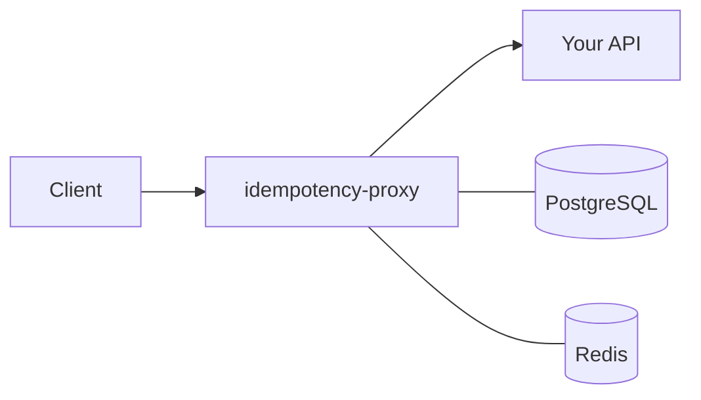
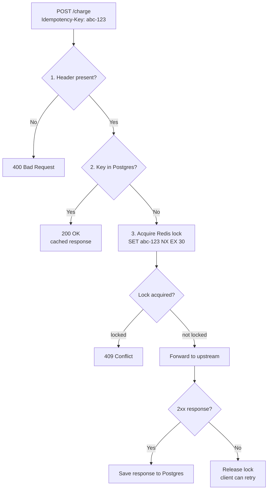

 


# idempotency-proxy

HTTP proxy that adds idempotency to any API. No changes needed on the upstream service.

Point it at your service, pass an `Idempotency-Key` header, and retried requests won't hit your backend twice.

---

## Why does this exist?

Networks are unreliable. A payment request can time out on the client side while the server already processed it. The client retries, and the customer gets charged twice.

Stripe and PayPal both solve this internally. I wanted the same thing without baking it into every service I write.



**Request flow:**



---

## Quick start

```bash
cp .env.example .env
# set UPSTREAM_URL to the API you want to protect

docker compose up
```

The proxy listens on `:3000`. The mock echo server runs on `:4000` by default so you can test immediately:

```bash
# first request — forwarded to upstream
curl -X POST http://localhost:3000/orders \
  -H "Idempotency-Key: my-key-001" \
  -H "Content-Type: application/json" \
  -d '{"item": "laptop"}'
# X-Idempotency-Cache: MISS

# exact same request — returned from cache, upstream never called
curl -X POST http://localhost:3000/orders \
  -H "Idempotency-Key: my-key-001" \
  -H "Content-Type: application/json" \
  -d '{"item": "laptop"}'
# X-Idempotency-Cache: HIT
```

---

## How it works

| Scenario | Behaviour |
|---|---|
| No `Idempotency-Key` header | `400 Bad Request` |
| First request with key | Forwarded to upstream, response cached in Postgres |
| Repeated request, same key + body | Cached response returned immediately |
| Repeated request, same key + **different body** | `422 Unprocessable Entity` |
| Duplicate request while first is still in-flight | `409 Conflict` |
| Key exists but TTL expired | Treated as a new request |
| Upstream returns a non-2xx | Response **not** cached, client can safely retry |

Redis handles the in-flight case with a short lock (`SET key NX EX 30`). Once upstream responds with a 2xx the response goes into Postgres and the lock gets marked done. After that every repeat just hits Postgres and returns early.

---

## Configuration

| Variable | Default | Description |
|---|---|---|
| `PORT` | `3000` | Port the proxy listens on |
| `UPSTREAM_URL` | — | Base URL of the API to protect |
| `REDIS_URL` | `redis://localhost:6379` | Redis connection string |
| `DATABASE_URL` | — | Postgres connection string |
| `TTL_SECONDS` | `86400` | How long to keep a cached response (seconds) |
| `LOCK_TTL_SECONDS` | `30` | In-flight lock expiry — max expected upstream latency |
| `LOG_LEVEL` | `info` | Pino log level |

---

## Admin endpoints

```
GET    /admin/keys/:key    — inspect a specific key
DELETE /admin/keys/:key    — manually invalidate a key
GET    /admin/stats        — total and expired record counts
GET    /admin/dashboard    — simple HTML view of the last 50 records
```

---

## Running tests

```bash
npm install
npm test
```

Tests mock both the Redis and Postgres layers so you don't need a running database:

- `tests/idempotency.test.ts` — core behaviour (cache hit, hash mismatch, lock conflict, upstream error)
- `tests/concurrent.test.ts` — race condition scenarios (10 simultaneous requests, expired TTL)

---

## Tech stack

- **Fastify** — HTTP server and routing
- **undici** — upstream HTTP client
- **ioredis** — Redis client
- **pg** — Postgres client
- **Vitest** — test runner

---

## Project structure

```
src/
  config.ts          env variables with validation
  types/index.ts     shared types
  store/
    redis.ts         lock acquire/release/status
    postgres.ts      CRUD for idempotency records
  proxy/
    forwarder.ts     sends requests to upstream
    middleware.ts    the core idempotency logic
    index.ts         Fastify server + admin routes
migrations/
  001_create_idempotency_table.sql
tests/
  idempotency.test.ts
  concurrent.test.ts
```
